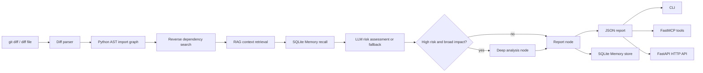

# CodeImpact Agent

CodeImpact Agent 是一个面向代码变更影响分析的 Python Agent 后端。输入一个 Python 仓库路径和一段 `git diff`，系统会解析变更文件、基于 Python AST 构建反向依赖图、召回相关代码/测试/文档上下文，并在配置 LLM 后输出结构化风险评估报告。

它不是普通聊天机器人，也不是前端演示项目。项目核心思路是：

> 确定性工具负责收集代码证据，LangGraph 负责流程编排，RAG 和 Memory 提供上下文，LLM 在证据约束下完成风险、Review 重点和测试重点推理，FastMCP 将能力暴露给外部 Agent 客户端。

## 核心能力

- `LangGraph` 状态机编排：`parse -> dependency -> retrieve_context -> reason_risk -> report`，高风险且影响面较大时进入 `deep_analysis` 节点。
- Python AST 依赖分析：解析 `import`、`from import`、相对导入、包导出和字符串字面量动态导入，构建反向依赖图。
- RAG 上下文召回：基于 SQLite FTS5/BM25 检索代码、测试和文档片段，作为风险评估证据。
- LLM 风险评估：通过 OpenAI-compatible SDK 接入模型，使用 JSON structured output 约束输出格式。
- SQLite Memory：保存历史分析结果，并在后续分析中召回同仓库相关记忆。
- 多入口调用：支持 Typer CLI、FastAPI HTTP API 和 FastMCP 工具调用。
- 可评测：内置 18 条 diff 回归样本和 pytest 单元测试。

## 输出示例

运行：

```powershell
python -m codeimpact analyze --repo data\eval\sample_repo --diff data\eval\sample_core.diff
```

输出结构示例：

```json
{
  "changed_files": ["pkg/core.py"],
  "related_files": [
    {
      "path": "<repo>\\pkg\\service.py",
      "module": "pkg.service",
      "depth": 1,
      "reason": "imported by pkg.core"
    }
  ],
  "risk_level": "medium",
  "risk_source": "llm",
  "risk_reasoning": "The change modifies core behavior used by downstream modules...",
  "test_focus": [
    "Test cases in tests/test_core.py that rely on run()."
  ],
  "review_focus": [
    "Check whether changed return values affect downstream consumers."
  ],
  "retrieved_context": [
    {
      "path": "tests/test_core.py",
      "chunk_type": "module",
      "score": 0.5033,
      "snippet": "from pkg.core import run"
    }
  ],
  "context_sources": [
    "AST reverse dependency",
    "RAG retrieved code/test/doc context"
  ]
}
```

如果配置了 LLM 环境变量，`risk_source` 会是 `llm`。如果未配置 LLM，系统会自动使用 deterministic fallback，保持离线测试和基础演示可运行。

## 架构



## 安装

```powershell
cd codeimpact-agent
python -m pip install -e .
```

如果需要运行 HTTP API：

```powershell
python -m pip install -e ".[api]"
```

## LLM 配置

本项目使用 OpenAI-compatible API，因此可以接入 OpenAI、DeepSeek、Kimi 等兼容接口。

PowerShell 示例：

```powershell
$env:CODEIMPACT_ENABLE_LLM="1"
$env:OPENAI_API_BASE="https://api.example.com/v1"
$env:OPENAI_API_KEY="<your-api-key>"
$env:OPENAI_CHAT_MODEL="your-model"
```

不要把真实 API Key 写入 README，也不要提交 `.env`。

面试或演示时建议使用 `--require-llm`，这样 LLM 不可用时会直接报错，而不是静默 fallback：

```powershell
python -m codeimpact analyze --repo data\eval\sample_repo --diff data\eval\sample_core.diff --require-llm
```

成功时输出里应能看到：

```json
{
  "risk_source": "llm"
}
```

## CLI 用法

直接分析 diff：

```powershell
python -m codeimpact analyze --repo data\eval\sample_repo --diff data\eval\sample_core.diff
```

运行完整 LangGraph 工作流，包括 Memory recall/store 和条件路由：

```powershell
python -m codeimpact analyze-graph --repo data\eval\sample_repo --diff data\eval\sample_core.diff
```

运行评测：

```powershell
python -m codeimpact evaluate --csv-path data\eval\sample.csv
```

当前评测输出示例：

```json
{
  "total": 18,
  "changed_file_hit_rate": 1.0,
  "related_file_hit_rate": 0.8888888888888888,
  "retrieval_hit_rate": 0.5555555555555556,
  "context_recall_at_5": 0.22727272727272727,
  "context_precision_at_5": 0.14925373134328357,
  "context_mrr_at_5": 0.33333333333333326
}
```

这些指标来自小规模回归样本，不是大规模 benchmark。样本中包含动态导入和检索 miss case，用来暴露静态 AST 和轻量 BM25 检索的边界。

## MCP Server

启动 MCP Server：

```powershell
python -m codeimpact.mcp_server
```

暴露的工具：

- `get_changed_files(diff_text)`：从 diff 中提取变更文件。
- `analyze_diff(repo, diff_text)`：运行完整 LangGraph 工作流并返回结构化报告。
- `search_code_context(repo, path)`：检索指定文件附近的代码上下文。
- `suggest_tests(repo, diff_text)`：基于变更和依赖关系给出确定性测试建议。
- `save_memory(namespace, content, memory_type)`：写入长期记忆。
- `recall_memory(namespace, query, memory_type, limit)`：召回历史记忆。

主要演示工具是 `analyze_diff`，它会串起 diff 解析、AST 反向依赖分析、RAG 召回、Memory、LLM/fallback 风险评估和报告生成。

## HTTP API

启动服务：

```powershell
uvicorn codeimpact.api:app --host 127.0.0.1 --port 8000
```

接口：

- `GET /health`
- `POST /changed-files`
- `POST /analyze`

示例请求：

```powershell
Invoke-RestMethod `
  -Method Post `
  -Uri http://127.0.0.1:8000/analyze `
  -ContentType "application/json" `
  -Body (@{
    repo = "data\eval\sample_repo"
    diff_path = "data\eval\sample_core.diff"
  } | ConvertTo-Json)
```

## 为什么这是 Agent 项目

这个项目不是“调用一次 LLM 的脚本”。Agent 特征来自四层设计：

- 工具层：diff parser、AST dependency graph、RAG retriever、SQLite Memory。
- 编排层：LangGraph 管理状态流、节点边界和条件路由。
- 推理层：LLM 在结构化证据和风险 rubric 约束下输出风险等级、Review 重点和测试重点。
- 接口层：CLI、FastAPI 和 MCP 让同一核心能力可以被不同客户端调用。

没有 LLM 时，系统仍能通过 fallback 输出同结构报告；有 LLM 时，风险推理会由模型完成，并通过 JSON schema 风格约束做结果规范化。

## 测试与验证

运行单元测试：

```powershell
python -m pytest tests\codeimpact -q
```

当前验证结果：

```text
29 passed, 2 warnings
```

两个 warning 来自第三方依赖的弃用提示，不影响项目测试结果。

推荐投递前检查：

```powershell
python -m pytest tests\codeimpact -q
python -m codeimpact evaluate --csv-path data\eval\sample.csv
python -m codeimpact analyze --repo data\eval\sample_repo --diff data\eval\sample_core.diff
```

如果配置了 LLM，再运行：

```powershell
python -m codeimpact analyze --repo data\eval\sample_repo --diff data\eval\sample_core.diff --require-llm
```

## 范围与限制

- 当前只支持 Python 仓库。
- 静态 AST 无法完整解析变量拼接、运行时注册等复杂动态导入。
- RAG 使用 SQLite FTS5/BM25，尚未引入 embedding 向量检索。
- 内置评测是回归样本集，不是大规模统计 benchmark。
- `test_suggestions` 是确定性模板和依赖分析结果，`test_focus` 才是 LLM/fallback 风险评估后的测试优先级。
- 当前没有前端、Docker/K8s、多语言分析和 GitHub App 集成。

## 面试 Demo 建议

1. 先跑测试，证明项目可运行：

```powershell
python -m pytest tests\codeimpact -q
```

2. 再跑普通分析，展示 changed files、related files、RAG context：

```powershell
python -m codeimpact analyze --repo data\eval\sample_repo --diff data\eval\sample_core.diff
```

3. 最后在有 API Key 的情况下跑 LLM 强制模式：

```powershell
python -m codeimpact analyze --repo data\eval\sample_repo --diff data\eval\sample_core.diff --require-llm
```

重点解释：

- 为什么 AST 依赖图比让 LLM 猜文件关系更可靠。
- RAG 召回给 LLM 提供了哪些代码/测试证据。
- `risk_source: "llm"` 和 fallback 的区别。
- 为什么 dynamic import 和低召回样本是项目的已知边界，而不是隐藏问题。
