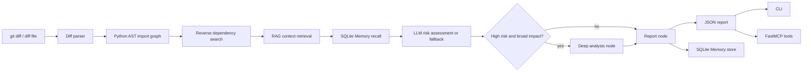

# CodeImpact Agent

CodeImpact Agent is a Python-only Agent backend for code change impact analysis: given a Python repository and a `git diff`, it extracts deterministic code evidence, traces downstream files with an AST import graph, asks an LLM to assess risk with an explicit rubric when API credentials are available, and returns a structured review report through both CLI and MCP tools.

It is intentionally not a frontend app, PDF QA demo, or generic chatbot. The interview story is:

> Deterministic tools collect code evidence; LangGraph orchestrates the workflow; Memory supplies historical context; the LLM performs bounded risk, review-focus, and test-focus reasoning; FastMCP exposes the same capabilities to external Agent clients.

## What It Outputs

Input:

```powershell
python -m codeimpact analyze --repo <path-to-python-repo> --diff docs\rca_e677b29.diff
```

Trimmed output:

```json
{
  "changed_files": [
    "scripts/run_full_matrix.py",
    "scripts/run_gate1_eval.py",
    "scripts/train_router_v2.py",
    "src/baselines/external.py",
    "src/models/router.py",
    "tests/test_fault_conditioning.py",
    "tests/test_router_learned.py"
  ],
  "related_files": [
    {
      "path": "C:\\Users\\29738\\Desktop\\github\\rca\\src\\baselines\\__init__.py",
      "reason": "reverse import dependency",
      "depth": 1
    }
  ],
  "risk_level": "medium",
  "risk_source": "fallback",
  "risk_reasoning": "AST found 1 reverse dependencies for the touched module(s); downstream tests should be prioritized.",
  "test_focus": [
    "Run tests covering `src/models/router.py`",
    "Run downstream tests for modules that import the touched files."
  ],
  "review_focus": [
    "Inspect behavioral changes in `src/models/router.py`",
    "Check whether changed symbols are part of an imported API used by related files."
  ],
  "confidence": 0.62,
  "evidence": [
    {
      "path": "src/models/router.py",
      "change_type": "modified",
      "added": ["..."],
      "deleted": ["..."]
    }
  ],
  "retrieved_context": [
    {
      "path": "tests/test_router_learned.py",
      "chunk_type": "function",
      "symbol": "test_router",
      "score": 0.38,
      "snippet": "..."
    }
  ],
  "context_sources": [
    "AST reverse dependency",
    "RAG retrieved code/test/doc context"
  ],
  "retrieval_ms": 3.2,
  "test_suggestions": [
    "Run unit tests covering `src/models/router.py`",
    "Run downstream regression tests for: C:\\Users\\29738\\Desktop\\github\\rca\\src\\baselines\\__init__.py"
  ]
}
```

When `CODEIMPACT_ENABLE_LLM=1`, `OPENAI_API_BASE`, `OPENAI_API_KEY`, and `OPENAI_CHAT_MODEL` are configured, `risk_source` becomes `llm`. The model receives a risk rubric, AST dependency evidence, diff hunk evidence, retrieved code/test/doc context, and optional Memory context, then returns `risk_reasoning`, `test_focus`, `review_focus`, `confidence`, `assumptions`, and cited evidence. Without the explicit LLM switch and API credentials, the tool falls back to deterministic heuristics with the same output shape so tests and offline demos stay stable.

## Architecture



Core design choices:

- `LangGraph` runs the analysis as an explicit state machine: parse diff -> build dependency evidence -> retrieve context -> reason about risk -> optionally deep analysis -> report.
- Python `ast` and import resolution handle related-file discovery instead of asking the LLM to guess project structure.
- SQLite FTS5/BM25 retrieval adds code, test, README, and docs snippets as evidence; it does not replace AST related-file analysis.
- The LLM is used only after structured evidence exists, so it focuses on rubric-based risk reasoning, review focus, test focus, confidence, and assumptions rather than raw code parsing.
- `SQLite Memory` stores prior analysis reports and the graph recalls recent history before risk assessment.
- `FastMCP` exposes the same backend as tools that can be called from MCP Inspector or an MCP-compatible client.

## Install

```powershell
cd codeimpact-agent
python -m pip install -e .
```

Install the optional HTTP API dependencies:

```powershell
python -m pip install -e ".[api]"
```

Optional LLM configuration:

```powershell
$env:CODEIMPACT_ENABLE_LLM="1"
$env:OPENAI_API_BASE="https://api.example.com/v1"
$env:OPENAI_API_KEY="sk-..."
$env:OPENAI_CHAT_MODEL="your-model"
```

## CLI Demo

Run the direct analyzer:

```powershell
python -m codeimpact analyze --repo <path-to-python-repo> --diff docs\rca_e677b29.diff
```

Run the LangGraph workflow, including Memory recall/store and conditional routing:

```powershell
python -m codeimpact analyze-graph --repo <path-to-python-repo> --diff docs\rca_e677b29.diff
```

Run the bundled evaluation harness:

```powershell
python -m codeimpact evaluate --csv-path data\eval\sample.csv
```

Expected evaluation shape:

```json
{
  "total": 9,
  "changed_file_hit_rate": 1.0,
  "related_file_hit_rate": 0.6666666666666666,
  "retrieval_hit_rate": 0.4444444444444444,
  "context_recall_at_5": 0.2857142857142857,
  "context_precision_at_5": 0.21428571428571427,
  "context_mrr_at_5": 0.48148148148148157
}
```

The `related_file_hit_rate` is intentionally not perfect: the sample set includes dynamic-import cases that expose the known limitation of static AST analysis. The `context_*` metrics are strict path-level checks against labeled `expected_context_files`; they are a small regression harness, not a large benchmark.

## MCP Server

Start the server:

```powershell
python -m codeimpact.mcp_server
```

Tools exposed:

- `get_changed_files(diff_text)`
- `analyze_diff(repo, diff_text)`
- `search_code_context(repo, path)`
- `suggest_tests(repo, diff_text)`
- `save_memory(namespace, content, memory_type)`
- `recall_memory(namespace, query, memory_type, limit)`

The main MCP demo tool is `analyze_diff`: it runs the LangGraph workflow, including diff parsing, AST reverse dependency analysis, Memory recall/store, LLM/fallback risk assessment, and conditional routing. It returns the same structured report shape as the graph CLI path.

## HTTP API

Start the FastAPI service:

```powershell
uvicorn codeimpact.api:app --host 127.0.0.1 --port 8000
```

Endpoints:

- `GET /health`
- `POST /changed-files`
- `POST /analyze`

Example request:

```powershell
Invoke-RestMethod `
  -Method Post `
  -Uri http://127.0.0.1:8000/analyze `
  -ContentType "application/json" `
  -Body (@{
    repo = "<path-to-python-repo>"
    diff_path = "docs\rca_e677b29.diff"
  } | ConvertTo-Json)
```

## Why This Is an Agent Project

This is not just a script that calls an LLM once. The Agent behavior comes from the division of labor:

- Tools: parse diffs, inspect repository imports, find reverse dependencies, retrieve local code/test/doc context, store and recall memory.
- Orchestration: LangGraph controls state, node boundaries, and conditional routing for broader high-risk changes.
- Reasoning: the LLM receives structured evidence plus an explicit risk rubric and produces risk reasoning, review focus, test focus, confidence, assumptions, and evidence when available; fallback keeps the system deterministic offline.
- Interface: MCP turns the backend into callable tools for other Agent clients instead of a closed command-line demo.

## Verification

See [docs/verification_evidence.md](docs/verification_evidence.md) for reproducible commands and outputs, including:

- test-suite command
- evaluation output
- a real repository analysis case
- an example LLM-backed risk reasoning sample

For an interview walkthrough, use [docs/demo_script.md](docs/demo_script.md).

## Scope and Known Limits

- Only Python repositories are supported.
- Static AST analysis cannot fully resolve variable-driven dynamic imports.
- The bundled eval set is a regression harness, not a statistically strong benchmark.
- `test_suggestions` are deterministic and AST-derived; `test_focus` is the LLM/fallback risk-driven prioritization layer, not a full generated test plan.
- No frontend, Docker stack, or multi-language support is included by design.

## Tests

```powershell
python -m pytest tests\codeimpact -q
```
